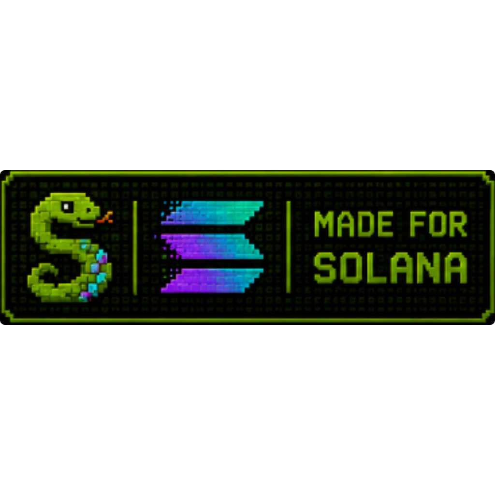

# Beta Overview

Snake OS is currently in **closed beta**. The first 20 wallets to accept the Terms get the OG slot + permanent BETA badge.

## The Cap

* **20 slots total** during closed beta
* Slot is claimed atomically on TOS-accept (not on first connect)
* Disconnecting before accepting doesn't burn a slot
* Slot 21 onward sees "Beta is full" and can't continue until we lift the cap

## Why 20?

The point of closed beta is **focused feedback from real testers** before exposing the app to a larger audience. 20 active testers, each playing daily, is enough to find every important bug and validate the core loop. More users = more support burden = slower iteration during the highest-leverage phase.

## What Closed Beta Tests

We're specifically validating:

* ✅ PvP escrow + race-safety (multiple settlements happening concurrently)
* ✅ Wallet flow across all wallet types (Phantom, Solflare, MWA)
* ✅ UI fit across mobile in-app browsers (Phantom, Solflare, Safari, Chrome)
* ✅ Anti-cheat on real scores
* ✅ Friend/PvP-invite/rematch flows
* ✅ Achievement + reward eligibility surfaces
* ✅ ORACLE / DEGEN / SNIPE integration with trustfi + DexScreener
* ✅ Treasury balance + refund flows

## What Closed Beta Is NOT

* ❌ A token-launch event (token is W3, not now)
* ❌ A guarantee of token rewards from beta play (placeholders only — see [Token Status](../snake-token/status.md))
* ❌ A polished public-launch experience (some PNGs may 404, some flows may be rough)

If you're an OG and find something broken, **tell us via the in-app HELP screen or report it in our [Telegram support topic](https://t.me/snakeOS_sol)**. Fast feedback = fast fixes.
