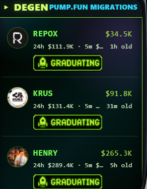

# What DEGEN Shows

DEGEN is a live feed of Solana memecoins migrating off the pump.fun bonding curve onto PumpSwap/Raydium. These are tokens that hit the \~$69k market cap threshold and just became fully tradable on a DEX.

## What You See

For each migration:

* **Token name + symbol**
* **Contract address**
* **Logo image** (from DexScreener)
* **Market cap** (live)
* **Liquidity** (USD)
* **24h volume** (USD)
* **5m volume** (USD) — surfaces tokens with sudden activity
* **Age since migration**
* **Bonding curve completion %**

## Data Sources

* **trustfi** supplies WHICH tokens are migrating + age + curve %
* **DexScreener** supplies live market data + token images

Two sources merged, edge-cached for 8 seconds so the feed feels live without hammering APIs.

## How to Use It

* Spot fresh launches in real-time
* Tap any token → detailed view with full market data + holder concentration
* Tap **BUY** → opens Jupiter swap modal (powered by jup.ag lite-api)
* Tap **SCAN** → routes the CA to ORACLE for a risk scan

## Free-and-Open Tool

DEGEN is informational. We don't earn fees from any migration you discover via DEGEN. We're not a launchpad — just a discovery surface for the active Solana memecoin scene.
