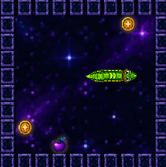

# Solo Play

Open with key **1** or the SNAKE home-screen icon.

## Rules

1. You're a snake moving 1 tile per tick across a grid.
2. Eat food (the glowing pellet) to grow longer and score points.
3. Hit a wall = game over.
4. Hit your own tail = game over.
5. Game speed increases as your snake grows (skill scales).

## Controls

* **D-pad arrows** → turn the snake
* **OK** → pause / resume
* **BACK** → exit to home (game state lost)

## Scoring

* Each food eaten = 1 point + length increase
* Powerups (if equipped) modify scoring temporarily
* High score saves to your profile + the leaderboard
* Solo runs are tagged `mode: 'solo'` in our database

## What Solo Earns You

| Reward | Solo earns it? |
|---|---|
| High score record | ✅ Yes |
| Leaderboard rank | ✅ Yes |
| Achievement unlocks | ✅ Yes (cosmetic) |
| BETA badge | ✅ Yes (if among first 20) |
| **the token claims** | ❌ **NO** — requires participation |

Solo play matters for your skill and profile, but does not earn token rewards. See [Reward Eligibility](../rewards/eligibility.md) for why and how to qualify.

## Anti-Cheat

Every solo score is checked server-side with a **synchronous preflight** — impossible scores (faster-than-physically-possible apple eats, suspicious tick rates) are flagged at insert time and excluded from leaderboard + future reward calculations. Botting or scripted input = ban per the Terms.
