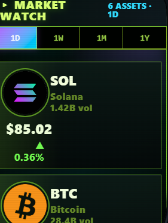

# MARKET WATCH

Charts for the majors + select memes. Open with key **7** or the MARKET WATCH home icon.

## Coins Tracked

| Coin | Source |
|---|---|
| **SOL** | Multiple |
| **BTC** | Multiple |
| **ETH** | Multiple |
| **XRP** | Bybit kline API |
| **HYPE** | Bybit kline API |
| **ZEC** | Binance kline API (Bybit has no ZEC spot) |

## Timeframes

1m / 5m / 15m / 1h / 4h / 1d

Each coin's chart is OHLCV (open/high/low/close/volume).

## Data Cache

Charts are fetched per-load with a short edge cache. We don't subscribe to streaming feeds during beta — this is a "lookup tool," not a "trading terminal."

## What It Is + Isn't

✅ A quick price + chart reference inside the phone
✅ Useful for verifying claims (was SOL really at $X yesterday?)
❌ Not a charting platform — no drawing tools, no indicators, no order entry
❌ Not connected to a brokerage

For deep TA, use TradingView or a proper terminal. For memecoin charts not listed here, use DexScreener directly.
