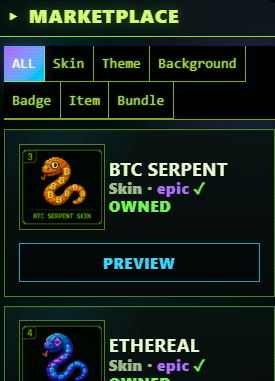

# The Market

Snake OS's market sells **cosmetic items** — skins, arenas, badges, powerups. Items are purchased with SOL and remain in your account permanently (subject to beta-grant wipe at public launch — see [Beta-to-Launch Migration](../beta/migration.md)).

## Item Categories

| Category | What |
|---|---|
| **Skins** | Visual snake appearance |
| **Arenas** | Game background environments |
| **Badges** | Profile flair (1 active at a time, visible in friends/leaderboard/chat) |
| **Powerups** | In-game consumable effects (up to 4 equipped) |
| **Packs** | Bundles of multiple items at a discount |
| **PFPs** | Profile pictures (visible in friends/chat) |

## Pricing

All prices are **server-authoritative** — defined in `server/marketPrices.ts`. You can't trick the client into purchasing at a discount; the server validates every purchase against its own price table.

Typical price ranges:

* Common skin: 0.05 – 0.1 SOL
* Rare skin: 0.15 – 0.3 SOL
* Epic skin: 0.4 – 0.7 SOL
* Legendary skin/arena: 1+ SOL
* Powerups: 0.02 – 0.05 SOL
* Bundles (Starter/Degen/Whale/Legendary): 0.3 – 2 SOL

Open the MARKET app for current pricing.

## Why Market Matters

Buying any market item:

1. Unlocks the cosmetic for permanent use in your Locker
2. **Qualifies you as an active participant** — unlocks $SNAKE achievement claims (see [Reward Eligibility](../rewards/eligibility.md))
3. Contributes to your `total_market_purchases` stat used by some achievements

Even a single 0.02 SOL powerup purchase converts your account from "spectator" to "participant" for reward purposes.
