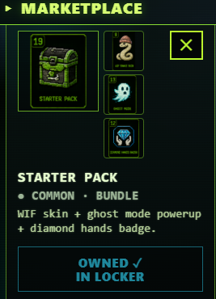

# Purchase Flow

## Step-by-Step

1. Open **MARKET** app.
2. Browse categories (skin / arena / badge / powerup / pack / pfp).
3. Tap an item → see preview + price.
4. Tap **BUY**.
5. Wallet popup → approve the SOL transfer to treasury.
6. Server verifies on-chain:
   * TX exists
   * Sender matches your connected wallet
   * Amount matches the server-side price table
   * Destination matches treasury wallet
7. Item added to your `market_purchases` → appears in Locker immediately.

## Anti-Replay Protection

Every market purchase TX signature is **UNIQUE-indexed** in the database (migration 016). A signature can only be used once. Attempting to replay a previous purchase TX → 409 error, no item granted.

## Failed Purchases

If the on-chain verification fails (TX not found yet, wrong amount, wrong destination, sig already used):

* The item is NOT granted
* Your SOL is still on-chain wherever the TX sent it — usually you didn't actually approve a transfer if the verify failed
* If you did transfer SOL but the verify failed (e.g., RPC race condition), the SOL went to treasury and you can report it in the support topic on Telegram with the TX hash for manual investigation

## Why On-Chain Verify

We don't trust the client. The flow is:

1. Client claims a purchase happened
2. Server fetches the TX from RPC and validates it
3. Only on validated TX does the item grant happen

This prevents a malicious client from sending fake "I bought X" requests.
