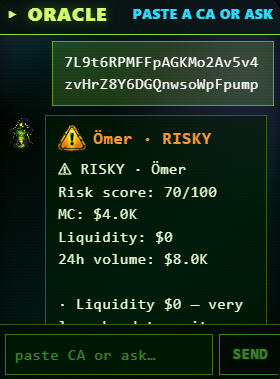

# Scanning a Contract



## How to Scan

1. Open **ORACLE** app.
2. Paste a Solana token contract address (32-44 base58 characters) into the chat input.
3. Hit send.
4. ORACLE detects the CA pattern, bypasses the AI providers, and runs a structured scan instead.

## What You Get Back

A formatted report like:

```
⚠ CAUTION · PEPSI
Risk score: 62/100
MC: $420K
Liquidity: $35K
24h volume: $180K

· Top 10 holders own 58% of supply
· Mint authority still active
· Liquidity is 8% of market cap (recommended >15%)
· Recent dev wallet activity detected
```

## What's Behind the Scan

Two data sources merged:

* **trustfi** — Solana-native risk radar, holder/dev analytics, mint/freeze authority status
* **DexScreener** — Live market data (price, liquidity, volume, market cap, token logo)

The combined verdict logic re-derives from real on-chain liquidity + 24h volume, so even tokens trustfi doesn't actively watch get a fair scan via DexScreener data.

## Risk Verdict Tiers

| Verdict          | Score  | What it means                                       |
| ---------------- | ------ | --------------------------------------------------- |
| ✓ **SAFE**       | 0–25   | Standard hygiene checks all green                   |
| ⚠ **CAUTION**    | 26–55  | Some yellow flags, due diligence recommended        |
| ⚠ **RISKY**      | 56–80  | Multiple red flags, treat as speculative            |
| ✗ **LIKELY RUG** | 81–100 | Severe concentration / authority / liquidity issues |

The scan is **informational**, not financial advice. ORACLE never says "buy" or "sell" — it surfaces signals, you decide.
