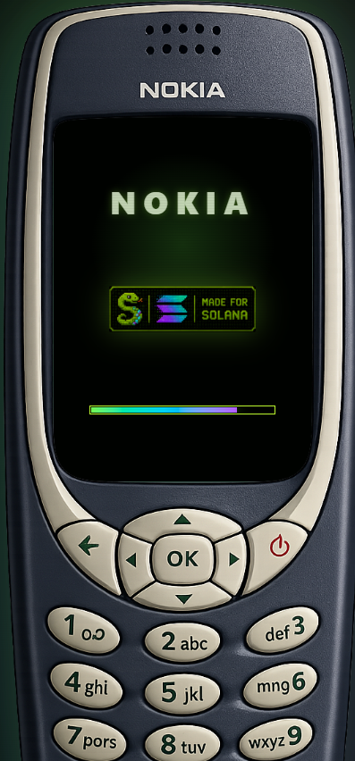

# Phone Layout

Snake OS is rendered as a faithful Nokia 3310. The structure top-to-bottom:

| Region | What |
|---|---|
| **Header** | NOKIA branding + signal/clock |
| **LCD Screen** | The active app — 18 different screens fit here |
| **D-Pad** | Navigation + snake movement |
| **Softkeys** | BACK (left) · END/power (right) |
| **Number Keys 1-9** | App shortcuts (see [Number Key Shortcuts](number-keys.md)) |
| **Decorative Row** | `*`, `0`, `#` — visual only, not interactive |

## Phone Sizing

| Platform | Phone width |
|---|---|
| Desktop | Centered, aspect-ratio bounded |
| Mobile Safari / Chrome | `min(100vw, 45dvh)` — auto-scales to fit |
| Phantom in-app browser | Auto-scales |
| Solflare in-app browser | Auto-scales |

The 45dvh cap ensures all 9 number keys remain visible with tap buffer on every wallet browser. On tight viewports the phone shrinks proportionally and centers with side margins — designed.

## What's Always Visible

* The active app fills the LCD
* D-pad + softkeys + number keys 1-9 are always tappable
* Floating ▤ HOME button appears on mobile when away from home, in case the keypad is clipped
