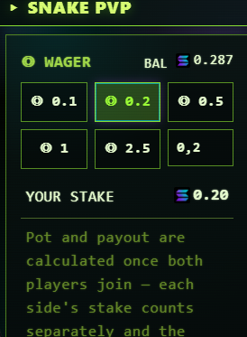

# How PvP Works



**PvP wagers use real Solana mainnet SOL.** Read this entire page before depositing.

## The Flow at a Glance

```
1. Create or Join a match  →  pvp_matches row created (status: waiting)
2. Both players deposit    →  on-chain TX to treasury, sig recorded
3. Both players ready up   →  status flips to "playing"
4. Both play their game    →  scores submitted, validated
5. Server settles match    →  winner determined (CAS-flip to "settled")
6. Winner credit added     →  claimable_pvp_sol field updated atomically
7. Winner claims winnings  →  on-chain payout from treasury
```

## Match States

| State | Meaning |
|---|---|
| `waiting` | Created, opponent not yet joined |
| `ready` | Both joined + both deposited |
| `playing` | Both clicked READY, game in progress |
| `settled` | Both scored, winner determined, fee taken |
| `cancelled` | Cancelled by creator or auto-cancelled at 5min idle (refunds processed) |

## Economics in 60 Seconds

* Wager range: **0.01 SOL minimum, 10 SOL maximum** per side
* Combined pot = `wager_p1 + wager_p2`
* **5% settle fee** deducted from the pot at settlement
* Winner credit = `pot × 0.95`
* **Additional 5% claim fee** when winner withdraws to wallet
* Net winnings to winner = `pot × 0.95 × 0.95` ≈ **90% of combined pot**

## Race Safety

All state transitions use Compare-And-Set (CAS) at the database level:

* Two players can't both claim the same "waiting" slot
* A match can't be cancelled AND settled
* Refunds can't double-fire
* Deposit signatures are uniqueness-indexed — sig replay is rejected

This makes the escrow safe even under heavy contention.

## Read These Next

* [Creating a Match](creating.md)
* [Joining a Match](joining.md)
* [Wagers, Pots & Fees](economics.md)
* [Cancels & Refunds](cancels.md)
