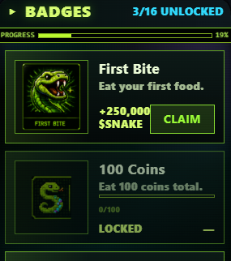

# Achievements & Badges

The BADGES app shows your achievement progress. Each achievement has:

* Name + description
* Icon
* Progress bar (current / target)
* Unlock state
* $SNAKE reward amount
* Claim button (gated by participation — see below)

## Achievement Categories

| Type | Examples | Reward Tier |
|---|---|---|
| **Capital** | wager_sol_total, market_purchase, skins_owned | 25K – 150K $SNAKE |
| **Skill** | pvp_wins, rank_reached, score_reached | 25K – 300K $SNAKE |
| **Social** | friends_count, emotes_used | 25K $SNAKE |
| **Cosmetic** | Equipped market badges | 25K $SNAKE |

Top-tier achievements (rank #1 reached, 100+ PvP wins, 10+ SOL wagered) pay the most — they're hardest to grind.

## The Gate — Read Carefully

**Achievement rewards are gated to participants.** You can unlock the badge as cosmetic progress no matter what — but the $SNAKE reward is only claimable if you have:

1. Made at least one market purchase, OR
2. Placed at least one PvP wager (real on-chain deposit), OR
3. (Post-token launch) Hold any amount of $SNAKE in your wallet

If you're not a participant when you try to claim:

* The CLAIM button is replaced with **🔒 PARTICIPATE**
* The screen shows a banner explaining the policy
* The achievement stays unlocked (you keep the cosmetic flex), just can't claim the $SNAKE

The moment you qualify (one market purchase, or one PvP deposit) — every previously-unlocked achievement becomes claimable.

See [Reward Eligibility](eligibility.md) for the full policy + rationale.
