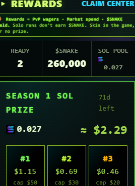

# PvP Claims

When you win a PvP match, your winnings accrue to your `claimable_pvp_sol` balance. You withdraw via the REWARDS app.

## The Flow

1. Win a PvP match or Tournament → server credits `claimable_pvp_sol += pot × 0.97` (PvP) or prize amount (Tournament)
2. Open REWARDS app → see your claimable balance
3. Tap **CLAIM** on the PvP Pot card
4. Wallet popup → confirm (just a signed message, no on-chain TX from your side)
5. Server `reserve_claimable_pvp_sol` RPC atomically debits your balance
6. Treasury sends the payout on-chain to your wallet
7. You see the TX signature in the confirmation
8. After 3% claim fee, you receive `claimable_pvp_sol × 0.97`

## Atomic Reserve Pattern

The balance is debited BEFORE the on-chain send. If the send fails, the balance is restored. This means:

* No double-spend possible
* You can safely retry CLAIM if it fails — your balance comes back, you just tap CLAIM again
* Race-safe under concurrent calls

## Strict Time-Window

PvP claim endpoints use **STRICT_MAX_AGE_MS = 15 minutes** on your signed message — your auth signature must be ≤15 min old to claim. This means you may be re-prompted to sign right before claiming if your session is old. Just a security floor on money-moving endpoints.

## When You Can't Claim

* Treasury balance temporarily insufficient (rare, alert if it persists) — try again in 30s
* RPC down (rare) — try again
* Solana network congestion — try again with higher priority fee (handled automatically)
* Your signed message expired (>15 min) — re-sign on prompt

If claim fails repeatedly, please report it in the support topic on Telegram with the timestamp.
