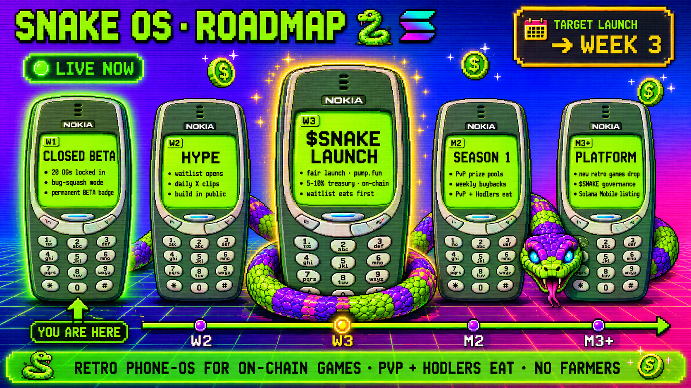

# Token Status: NOT LIVE YET

> ⚠ **The token has not launched.** Any UI element in Snake OS showing "claimable rewards", "earned tokens", or pre-launch token amounts is a placeholder. **No tokens accumulate during the beta. Pre-launch reward numbers will NOT be honoured.**

The reward system goes live **only after** the token is deployed.

## Current Timeline

We're following the public roadmap:

| Phase | Status |
|---|---|
| **W1 — Closed Beta** | 🟢 LIVE NOW |
| W2 — Hype / Waitlist | Upcoming |
| W3 — Token Launch | Target |
| M2 — Season 1 | Post-launch |
| M3+ — Platform | Long-term |

## What Happens When Token Launches

1. Fair launch on **pump.fun** — no presale, no team allocation
2. Snake OS treasury wallet buys 5–10% of supply on the launch curve (transparent, on-chain, labeled)
3. Snake OS app opens to public the same hour
4. Waitlist gets 5–10 minute notification head-start
5. Achievement claims, PvP buyback distributions, and the holder-distribution loop all go live
6. The reward system starts fresh — all the "earned" numbers showing during beta are wiped to zero. Real tokens start accumulating from the first post-launch action you take.

## Why "NOT Live Yet" Matters

If you're reading the UI literally:

* "You've earned 250,000 tokens" — placeholder. Not real tokens. Will not be claimable.
* "1,500,000 tokens in claimable rewards" — placeholder. Will be zeroed at launch.
* Solo-grinder accounts will not get a single token from pre-launch activity.

This is stated in the Terms of Service (Clause 4). Accepting the TOS = acknowledging this.

## What's Real Right Now

* ✅ SOL is real. PvP wagers are real Solana mainnet.
* ✅ Market purchases are real on-chain SOL transfers.
* ✅ Cosmetics are real (your owned items stay yours, with one exception: beta-grant items are wiped at launch in exchange for 3 free items of choice — see [Beta-to-Launch Migration](../beta/migration.md)).
* ✅ Achievements unlock for real (the badges are permanent flex).
* ❌ The token is NOT real yet. Anything labeled "the token" is a placeholder.
