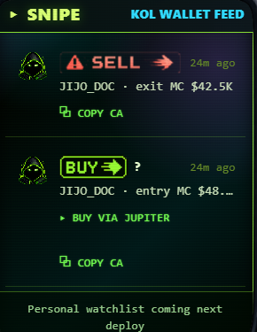

# What SNIPE Shows

SNIPE tracks recent activity from notable Solana wallets — KOLs, known traders, and tracked accounts. See what they're buying and selling in near-real-time.

## What You See

For each KOL wallet activity:

* **KOL handle** (mapped from wallet to known identities)
* **Token bought/sold**
* **Amount in SOL**
* **Timestamp**
* Tap to see the wallet's recent activity in full

## Data Source

Powered by trustfi's KOL tracker. Edge-cached 15 seconds.

## Use Cases

* **Follow smart money** — see what tokens established traders are accumulating
* **Spot exit pumps** — when a KOL who often pumps small caps starts selling
* **Discover tokens** — KOLs often buy fresh tokens before they trend on DEGEN

## Honest Note

KOL tracking is a **signal**, not a strategy. KOLs:

* Are often paid to shill (their "alpha" may be a sponsored post)
* Have insider access you don't (don't try to front-run them)
* Are wrong often (don't blind-follow)

Use SNIPE as one input among several (ORACLE scan, DEGEN volume, your own thesis), never as a sole decision driver.
